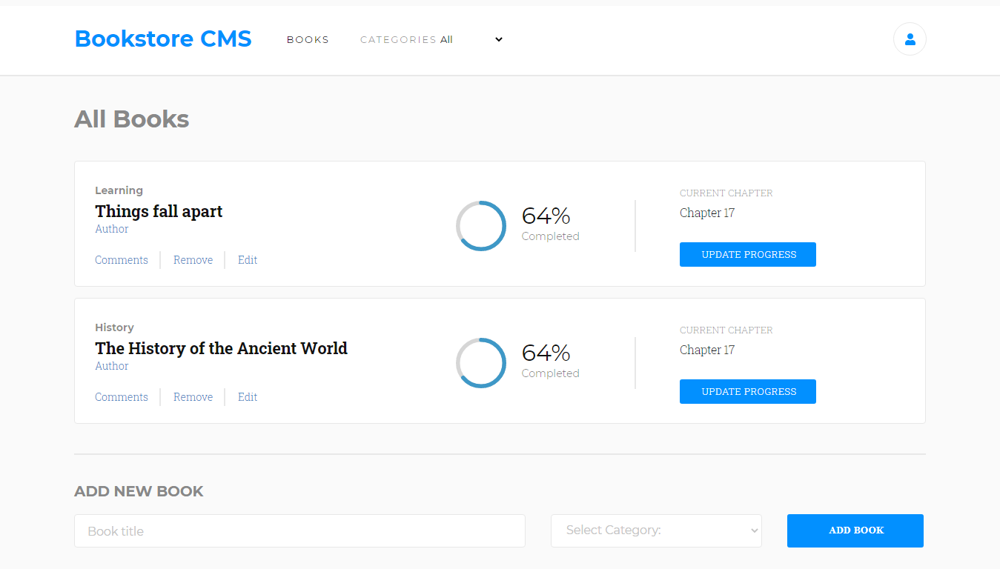

# Magic Bookstore Manager

The front-end implementation of a web bookstore application.

## Application Screenshot

## Content

<a text-align="center" href="#about">Background</a>&nbsp;&nbsp;&nbsp;|&nbsp;&nbsp;&nbsp;
<a href="#ins">Installations</a>&nbsp;&nbsp;&nbsp;|&nbsp;&nbsp;&nbsp;
<a href="#usage">Usage</a>&nbsp;&nbsp;&nbsp;|&nbsp;&nbsp;&nbsp;
<a href="#app">App</a>&nbsp;&nbsp;&nbsp;|&nbsp;&nbsp;&nbsp;
<a href="#with">Building</a>&nbsp;&nbsp;&nbsp;|&nbsp;&nbsp;&nbsp;
<a href="#author">Author</a>

## Background 

This project was built to accomplish a task by Microverse Inc to build the front-end of a web bookstore manager application. The milestones below comprised the development process.
1. Project setup.
2. Project folder structure layout.
3. Make the page dynamic - This involved adding books to and removing books from the redux store.
4. Implement a book-list filter.

## Live Demo
The Features of the application were deployed to Heroku

### Checkout the live link [here](https://secure-sierra-90806.herokuapp.com/)

## 🔧 Building

The tools used to build the application are listed below:

- React
- prop-types
- react-redux
- redux
- eslint
- stylelint

## Usage 

To use the code in this repository, follow the steps in this section:

### 🔨 Prerequisites

You should have the following packages installed on your computer inorder to run the code contained herein.

- Node JS
- npm and npx

### 🔨 Setup

First get a copy of the project on your computer:

- Clone or download the repository to a local directory on your computer by following the Github instructions at [Github clone/download repository](https://docs.github.com/en/enterprise/2.13/user/articles/cloning-a-repository).

### 🛠 Installing 

Once you have a local copy of the entire project on your computer, then:

- If you don't meet the above prerequisites, visit [node download and installations docs](https://docs.npmjs.com/downloading-and-installing-node-js-and-npm) to install node js and npm.
- After installations, change directory into the directory where you cloned the repository.
- Open the project directory in your editor of choice. For example running `code .` will open the project in VSCode.
- Run `npm install` to install the project dependencies in the package.json file.

### Magic Bookstore Application 

With the above setup complete, you are set to locally use the code. The following steps provide a guide:

- Run `npm start` to start webpack-dev-server.
- If everything worked well, the browser should automatically render the bookstore manager application on `http://localhost:3000/`.

## ✒️ Author 

👤 **Mworekwa Ezekiel**

- Github: [@vanheaven-ui](https://github.com/vanheaven-ui)
- Twitter: [@MworekwaE](https://twitter.com/MworekwaE)
- Linkedin: [@linkedin](https://www.linkedin.com/in/vanheaven/)
- Email: [ezekiel](mailto:vanheaven6@gmail.com)

## 🤝 Contributing

Contributions, issues and feature requests are welcome!

- To create an issue, visit the [issues page](https://github.com/vanheaven-ui/React-calc/issues) and create a new issue.
- To contribute to the code base, follow the steps below:
  1. Fork this repository to your remote respository by clicking the Fork button in this repository.
  2. Clone this repository to a directory on your computer by following Github guidelines.
  3. Change directory into the directory where you cloned this repository to.
  4. Open the directory using your favorite editor.
  5. Create a feature branch off the develop branch.
  6. Make and commit the nuanced code.
  7. Open a pull request describing the improvements made
     And your reward awaits in heaven.

## 👍 Show your support

Give a ⭐️ if you like this project!

## :clap: Acknowledgements

- [Microverse Community](https://www.microverse.org/)  
- [Redux getiing started Documentation](https://redux.js.org/introduction/getting-started)